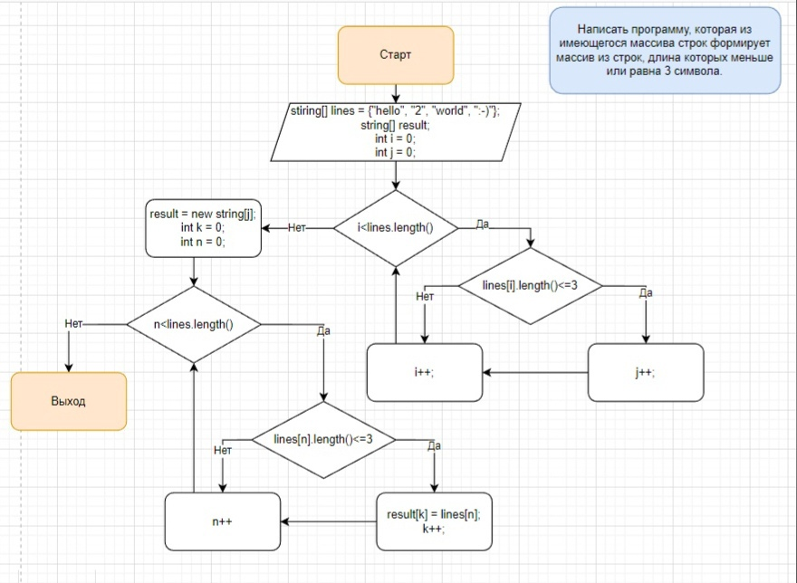

# **Решение итоговой контрольной I четверть GeekBrains**

## Поэтпаное рещение:
1. Начало программы.
2. Первоначальные данные: проверяемый массив, итоговый массив, служебные переменные i и j.
3. Начало цикла: проверить длину элементов проверяемого массива.

* Если длина элемента массива меньше или равна 3, то инкрементировать j. Перейти к следующему элементу массива.
* Иначе перейти к следующему элементу массива.
4. Когда все элементы массива пройдены, инициализировать итоговый массив длиной j.
5. Создать и инициализировать новые вспомогательные переменные n и k.
6. Начало цикла: проверить длину элементов проверяемого массива.
* Если длина элемента массива меньше или равна 3, то в итоговый массив копировать значение элемента проверяемого массива  и инкрементировать j. Перейти к следующему элементу массива.
* Иначе перейти к следующему элементу массива.
7. Завершить программу.
